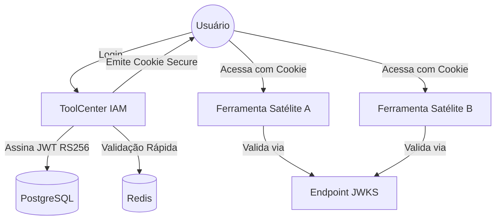

# 🛡️ ToolCenter IAM - Hub de Identidade e Acesso

O **ToolCenter IAM** é uma solução robusta e centralizada para Gestão de Identidade e Acesso (IAM), projetada para atuar como o coração de um ecossistema de ferramentas corporativas. Utilizando padrões modernos de segurança como **RS256 JWT** e **JWKS**, ele provê uma experiência de **Single Sign-On (SSO)** segura, escalável e de fácil integração.


---

## 🚀 Principais Funcionalidades

*   **Autenticação Centralizada (SSO):** Um único ponto de login para todas as ferramentas do ecossistema.
*   **Segurança com RS256:** Assinatura de tokens usando chaves assimétricas, garantindo que apenas o IAM possa emitir permissões.
*   **JWKS Nativo:** Endpoint `/.well-known/jwks.json` para validação automática de tokens por aplicações satélites.
*   **Gestão de Perfis em Níveis:**
    *   **Nível 1 (Portal):** ADMIN, OPERATOR, VIEWER.
    *   **Nível 2 (Ferramentas):** Permissões específicas por aplicação.
*   **Auditoria Completa:** Rastreamento detalhado de acessos e ações administrativas.
*   **Painel Administrativo SPA:** Gestão intuitiva de usuários, ferramentas e logs.
*   **Políticas de Senha:** Troca obrigatória no primeiro acesso e validação de complexidade OWASP.
*   **Blacklist em Tempo Real:** Revogação imediata de tokens via Redis/Postgres para logout global seguro.

---

## 🛠️ Stack Tecnológica

*   **Runtime:** Node.js + TypeScript
*   **Framework:** Express.js
*   **Banco de Dados:** PostgreSQL (Persistência) + Redis (Cache/Blacklist)
*   **ORM:** Prisma
*   **Segurança:** JWT (RS256), Helmet, BcryptJS, Zod, Rate Limiting
*   **Infra:** Docker & Docker Compose

---

## 🏗️ Arquitetura

O sistema utiliza uma arquitetura baseada em domínios modulares e segurança por cookies `HttpOnly`:



---

## 🚦 Começando

### Pré-requisitos
*   Docker e Docker Compose
*   Node.js 20+ (para desenvolvimento local)

### Instalação Rápida

1.  **Clone o repositório e configure as variáveis:**
    ```bash
    cp .env.example .env
    ```

2.  **Suba a infraestrutura:**
    ```bash
    docker-compose up -d
    ```

3.  **Prepare o ambiente (Primeira execução):**
    ```bash
    npm install            # Instala dependências
    npm run generate-keys  # Gera o par de chaves RSA
    npm run migrate        # Cria as tabelas no banco
    npm run seed           # Popula dados iniciais (Admin/Roles)
    ```

4.  **Inicie em modo desenvolvimento:**
    ```bash
    npm run dev
    ```

O servidor estará disponível em `http://localhost:3000`.

---

## 🔐 Dados de Acesso (Seed)

| Usuário | E-mail | Senha | Perfil |
| :--- | :--- | :--- | :--- |
| **Ana Admin** | `ana@toolcenter.com` | `1234` | ADMINISTRADOR |
| **Beto Operador** | `beto@toolcenter.com` | `1234` | OPERADOR |

*Nota: Será solicitada a troca de senha no primeiro login.*

---

## 📖 Documentação Adicional

*   [Arquitetura Detalhada](ARCHITECTURE_AUTH.md)
*   [Fluxo de Autenticação](AUTH_FLOW.md)
*   [Guia de Design de Interface](DESIGN.md)

---

## 📄 Licença

Este projeto está sob a licença ISC. Veja o arquivo [package.json](package.json) para mais detalhes.

---
Desenvolvido com ❤️ por Fabiano e Antigravity.
